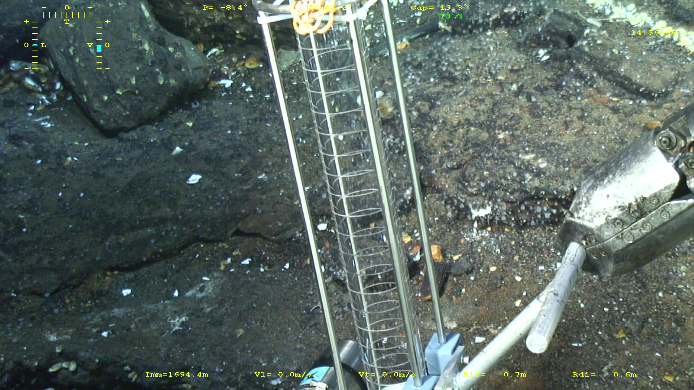
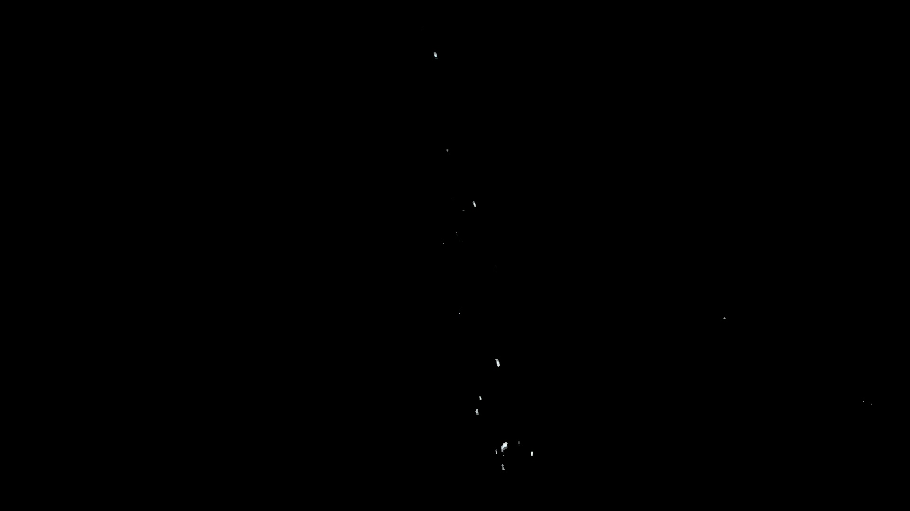
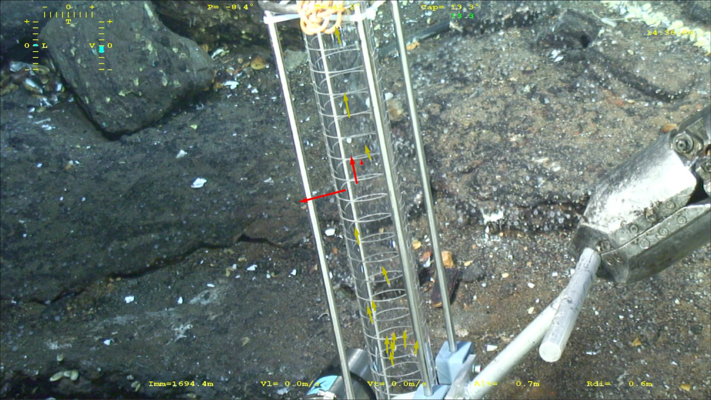
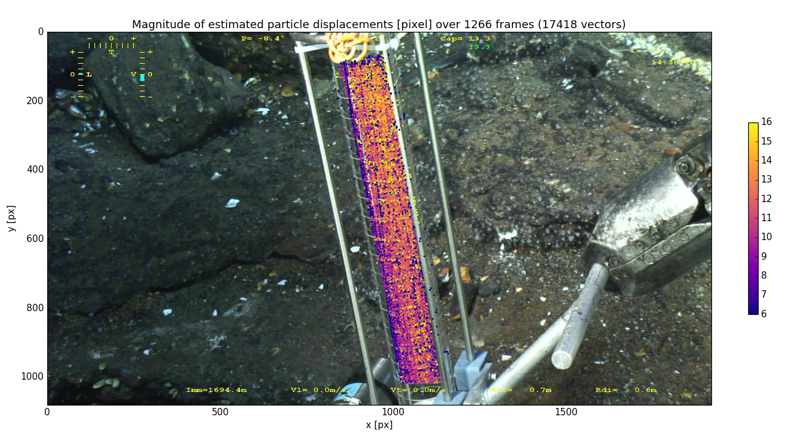

# whiteSmoker
Python scripts demonstrating video-based fluid velocity measurements at the output of "white smokers" ([hydrothermal vents](https://en.wikipedia.org/wiki/Hydrothermal_vent#Black_smokers_and_white_smokers)).

This set of scripts implements a basic particle tracker for the video-based estimation of **white smoker flow** velocity. Similarly to [Particle Image Velocimetry](https://en.wikipedia.org/wiki/Particle_image_velocimetry) (PIV), it relies on the apparent displacement of the tiny particles carried away by the flow.

## Requirements
- Scientific Python distribution including numpy, scipy, matplotlib, scikit-image. E.g. [Anaconda](https://www.continuum.io/downloads), [Canopy](https://www.enthought.com/products/canopy/).
- ...

## Concept
Below is a sample frame from a video record of a white smoker.

First, particles moving in the tube are isolated thanks to a background/foreground detection algorithm. This work relies on the "[Running Gaussian average](https://en.wikipedia.org/wiki/Background_subtraction#Running_Gaussian_average)", implemented in [whitesmoker_preproc.py](whitesmoker_preproc.py).
Below is the same frame as before, now showing particles only.

Then, the displacement of each particle is estimated between two consecutive frames using a classical cross-correlation approach, implemented in [whitesmoker_track.py](whitesmoker_track.py). A quality control process removes the spurious estimates, shown in red in the image below.

## Results
The figure below show the displacement magnitude, in pixel, measured over 1266 frames (about 50 s of video). Each dot corresponds to a vector.
This proxy to an "average displacement field" is consistent with what can be expected:
- the displacements are larger at the center of the tube than near its boundary;
- the displacements are also larger in the upper area than in the lower area. Indeed, the former is closer to the camera.

This is a simple demonstrator. For actual measurements, images must be first rectified in order to enable the conversion from estimated displacements to velocity.

## Credits
Design, implementation and processing by [Pierre Dérian](http://www.pierrederian.net).
Data from [Philippe Rodier, IFREMER](http://wwz.ifremer.fr/deep).
